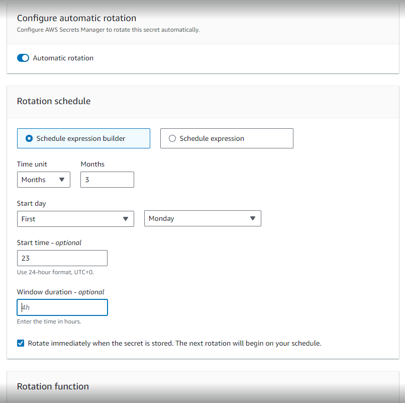
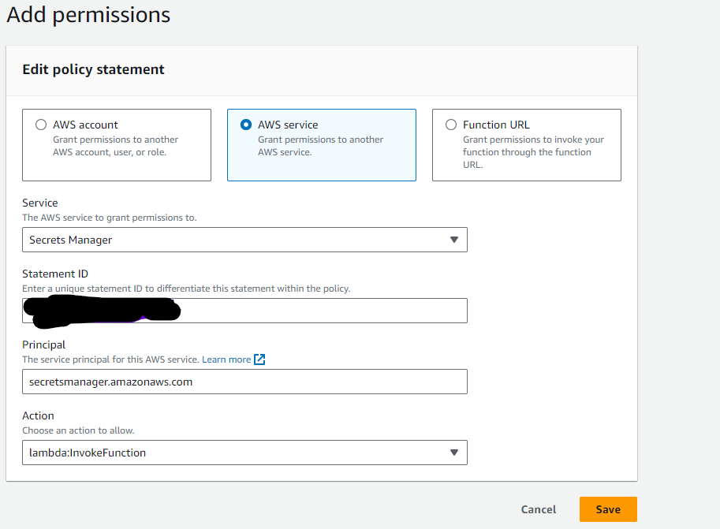

# AWS - how to rotate secrets using

Description of implementation

We want to rotate every 90 days the value defined in the Secrets Manager as key/value pair /myApp-1/myGroup-1/mySecret-1 with Encryption key aws/secretsmanager
This the secret will have a rotation defined.
This rotation will have a lambda function associated that needs to be created only first time (todo).
This lambda will replace the key with a new one (using your custom method to encrypt).
The role attached to the lambda needs to have a new policy for allowing it to modify the secret (todo).
Each time a new secret is using the lambda we need to add its arn in the previous policy
if all ok: after a rotation there will be another version for the AWSCURRENT and the previous version will be marked with AWSPREVIOUS.

Steps to add a rotation for a secret
1. In the secret details go to Rotation and click Edit rotation
2. Check Automatic rotation and fill all the fields:
   1. 
3. In the Rotation function: if this is the first rotation we will need to click Create function (if we already have a rotation we need just to select the function from the dropdown)
4. When creating a lambda function we need to select Author from scratch, Function name=myrotation-t1-test, Runtime=python, Architecture=x86_64 and click Create function
5. In the function page we need to add our code in the lambda_function.py ( I have used a simple hmac encoding):
   1. 
   ```python 
   {
    import json
    import boto3
    import os
    import hashlib
    import base64

    def lambda_handler(event, context):
        """Secrets Manager Rotation Template

        This is a template for creating an AWS Secrets Manager rotation lambda

        Args:
            event (dict): Lambda dictionary of event parameters. These keys must include the following:
                SecretId: The secret ARN or identifier
            -   ClientRequestToken: The ClientRequestToken of the secret version
            -   Step: The rotation step (one of createSecret, setSecret, testSecret, or finishSecret)
                context (LambdaContext): The Lambda runtime information
        Raises:
            ResourceNotFoundException: If the secret with the specified arn and stage does not exist
            ValueError: If the secret is not properly configured for rotation
            KeyError: If the event parameters do not contain the expected keys
    """
        arn = event['SecretId']
        token = event['ClientRequestToken']
        step = event['Step']

        # Setup the client
        client = boto3.client("secretsmanager")
    
        # Make sure the version is staged correctly
        metadata = client.describe_secret(SecretId=arn)
    
        if not metadata['RotationEnabled']:
            raise ValueError("Secret %s is not enabled for rotation" % arn)
        versions = metadata['VersionIdsToStages']
        if token not in versions:
            raise ValueError("Secret version %s has no stage for rotation of secret %s." % (token, arn))
        if "AWSCURRENT" in versions[token]:
            #Secret version %s already set as AWSCURRENT for secret %s
            return
        elif "AWSPENDING" not in versions[token]:
            raise ValueError("Secret version %s not set as AWSPENDING for rotation of secret %s." % (token, arn))
    
        #print(f"step: {step}")
        #print(f"event: {event}")
    
        if step == "createSecret":
            createSecret(client, arn, token)
        elif step == "setSecret":
            setSecret(client, arn, token)
        elif step == "testSecret":
            testSecret(client, arn, token)
        elif step == "finishSecret":
            finishSecret(client, arn, token)
        else:
            raise ValueError("Invalid step parameter")
    
    def createSecret(client, arn, token):
        """Create the secret

        This method first checks for the existence of a secret for the passed in token. If one does not exist, it will generate a
        new secret and put it with the passed in token.
        Args:
            service_client (client): The secrets manager service client
            arn (string): The secret ARN or other identifier
            token (string): The ClientRequestToken associated with the secret version
        Raises:
            ResourceNotFoundException: If the secret with the specified arn and stage does not exist
        """
    
        # Now try to get the secret version, if that fails, put a new secret
        try:
            client.get_secret_value(SecretId=arn, VersionId=token, VersionStage="AWSPENDING")
        except client.exceptions.ResourceNotFoundException:
            # Generate a random password
            #passwd = client.get_random_password(ExcludeCharacters='/@"\'\\') #todo
            passwd = generateSecret()
            # Put the secret
            client.put_secret_value(SecretId=arn, ClientRequestToken=token, SecretString=passwd, VersionStages=['AWSPENDING'])

    def setSecret(client, arn, token):
        """Set the secret

        This method should set the AWSPENDING secret in the service that the secret belongs to. For example, if the secret is a database
        credential, this method should take the value of the AWSPENDING secret and set the user's password to this value in the database.
        Args:
            service_client (client): The secrets manager service client
            arn (string): The secret ARN or other identifier
            token (string): The ClientRequestToken associated with the secret version
        """
        # This is where the secret should be set in the service
        print("No database user credentials to update...")

    def testSecret(client, arn, token):
        """Test the secret
        This method should validate that the AWSPENDING secret works in the service that the secret belongs to. For example, if the secret
        is a database credential, this method should validate that the user can login with the password in AWSPENDING and that the user has
        all of the expected permissions against the database.
        If the test fails, this function should raise an exception. (Any exception.)
        If no exception is raised, the test is considered to have passed. (The return value is ignored.)
        Args:
            service_client (client): The secrets manager service client
            arn (string): The secret ARN or other identifier
            token (string): The ClientRequestToken associated with the secret version
        """
        # This is where the secret should be tested against the service
        print("No need to testing against any service...")

    def finishSecret(client, arn, token):
        """Finish the secret
        This method finalizes the rotation process by marking the secret version passed in as the AWSCURRENT secret.
        Args:
            service_client (client): The secrets manager service client
        arn (string): The secret ARN or other identifier
        token (string): The ClientRequestToken associated with the secret version

        Raises:
            ResourceNotFoundException: If the secret with the specified arn does not exist

        """
        # First describe the secret to get the current version
        metadata = client.describe_secret(SecretId=arn)
        #print(f"metadata: {metadata}")       
        current_version = None
        for version in metadata["VersionIdsToStages"]:
            #print(f"check version: {version}") 
            if "AWSCURRENT" in metadata["VersionIdsToStages"][version]:
                if version == token:
                    # The correct version is already marked as current, return
                    return
                current_version = version
                break
        #print(f"current_version: {current_version}")        
        # Finalize by staging the secret version current
        client.update_secret_version_stage(SecretId=arn, VersionStage="AWSCURRENT", MoveToVersionId=token, RemoveFromVersionId=current_version)

        # Remove pending from new version
        if 'AWSPENDING' in metadata["VersionIdsToStages"][token]:
            client.update_secret_version_stage(SecretId=arn, VersionStage="AWSPENDING", RemoveFromVersionId=token)
    
    def generateSecret():
        # Generate a random secret key (32 bytes)
        random_key = os.urandom(32)
        # Create an instance of HMAC-SHA256
        hmac_sha256 = hashlib.sha256(random_key)
        # Get the digest (key) in bytes
        hmac_key_bytes = hmac_sha256.digest()
        # Convert the key to a Base64-encoded string
        hmac_key_base64 = base64.b64encode(hmac_key_bytes).decode("utf-8")
        return hmac_key_base64
    }
    ```
6. Save it and than we can click Test. After checking it we need to click Deploy
7. Here, on the lambda page, on Configuration tab select Permissions and click Add permissions button and select AWS service, Secrets Manager, any Statement ID, Principal=secretsmanager.amazonaws.com, Action=lambda:InvokeFunction and click Save
   1. 
8. Back on the function page click on the role in order to edit it
9. In the role page on the Permissions tab we need to click Add permissions
   1.  if the policy (let call it my-rotation-secrets) already exists we just need to select it
   2.  if the my-rotation-secrets policy doesn’t exist we need to create it
        ```json 
        {
            "Version": "2012-10-17",
            "Statement": [
            {
                "Effect": "Allow",
                "Action": [
                    "secretsmanager:DescribeSecret",
                    "secretsmanager:GetSecretValue",
                    "secretsmanager:PutSecretValue",
                    "secretsmanager:UpdateSecretVersionStage"
            ],
            "Resource": "arn:aws:secretsmanager:<region>:<accountid>:secret:/myApp-1/myGroup-1/mySecret-1-12345"
        }
        ```
        in the Resource field we need to add the ARN of the secret
10. Going back to the page of the secret on the Rotation tab on Edit Rotation we will use the newly created lambda function

Testing
1. click Rotate secret immediately in the Rotation tab of the secret page and wait ~1 minute
2. check then Versions tab to see if you have new AWSCURRENT and the old version has now  AWSPREVIOUS label. If you see anything else beside just 2 versions (AWSCURRENT and AWSPREVIOUS) then the rotation had errors
3. for debugging go to the lambda page
4. here in the Monitor tab click View CloudWatch logs
5. here check the Log streams
6. also in the code of the lambda we can use print(<message>) and the message will also be displayed in the CloudWatch logs

What’s next
Transform lambda code from python to c#


Links
How rotation works https://docs.aws.amazon.com/secretsmanager/latest/userguide/rotating-secrets.html#rotate-secrets_how

AWS - template for lambda rotation https://docs.aws.amazon.com/secretsmanager/latest/userguide/reference_available-rotation-templates.html#OTHER_rotation_templates

GitHub example https://github.com/aws-samples/aws-secrets-manager-rotation-lambdas/blob/master/SecretsManagerRotationTemplate/lambda_function.py

Lambda rotation function execution role permissions for AWS Secrets Manager https://docs.aws.amazon.com/secretsmanager/latest/userguide/rotating-secrets-required-permissions-function.html 

Using an AWS Secrets Manager VPC endpoint https://docs.aws.amazon.com/secretsmanager/latest/userguide/vpc-endpoint-overview.html

